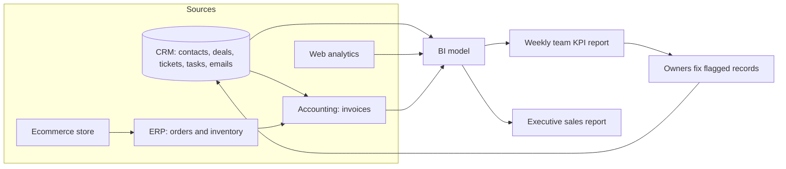

# Data flow: sources to dashboards

```mermaid
flowchart LR
    subgraph Sources
      CRM[(CRM: contacts, deals, tickets, tasks, emails)]
      WEB[Web analytics]
      ECOM[Ecommerce store]
      ERP[ERP: orders and inventory]
      ACC[Accounting: invoices]
    end
    ECOM --> ERP
    CRM --> ACC
    ERP --> ACC
    CRM --> BI[BI model]
    WEB --> BI
    ACC --> BI
    BI --> D1[Weekly team KPI report]
    BI --> D2[Executive sales report]
    D1 --> Q[Owners fix flagged records]
    Q --> CRM
```

The last arrow matters: dashboards flag bad records by owner, owners fix them in the CRM, and the next refresh shows the improvement.
