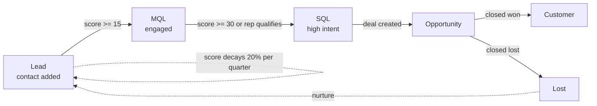
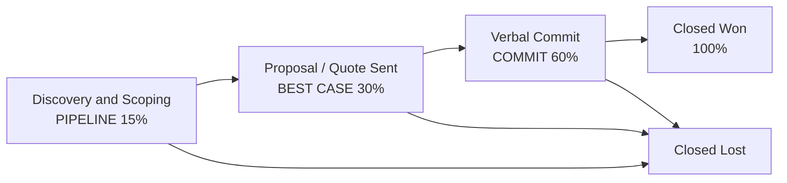

# Funnel and lead lifecycle

```mermaid
flowchart LR
    L[Lead<br/>contact added] -->|score >= 15| M[MQL<br/>engaged]
    M -->|score >= 30 or rep qualifies| S[SQL<br/>high intent]
    S -->|deal created| O[Opportunity]
    O -->|closed won| C[Customer]
    O -->|closed lost| X[Lost]
    L -.->|score decays 20% per quarter| L
    X -.->|nurture| L
```

## Deal stages and forecast mapping

```mermaid
flowchart LR
    A[Discovery and Scoping<br/>PIPELINE 15%] --> B[Proposal / Quote Sent<br/>BEST CASE 30%]
    B --> C[Verbal Commit<br/>COMMIT 60%]
    C --> D[Closed Won<br/>100%]
    A --> E[Closed Lost]
    B --> E
    C --> E
```
