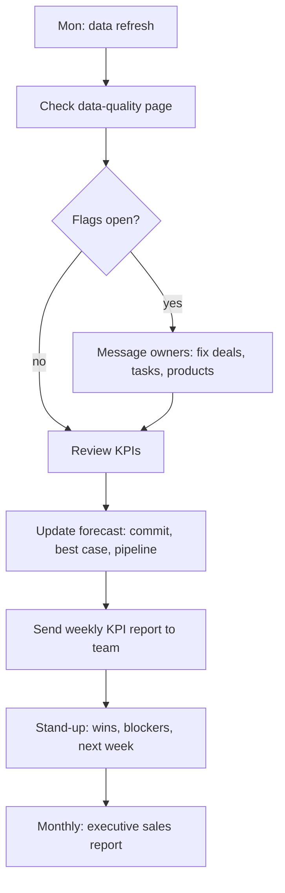

# Weekly reporting process

```mermaid
flowchart TD
    A[Mon: data refresh] --> B[Check data-quality page]
    B --> C{Flags open?}
    C -->|yes| D[Message owners: fix deals, tasks, products]
    C -->|no| E[Review KPIs]
    D --> E
    E --> F[Update forecast: commit, best case, pipeline]
    F --> G[Send weekly KPI report to team]
    G --> H[Stand-up: wins, blockers, next week]
    H --> I[Monthly: executive sales report]
```
