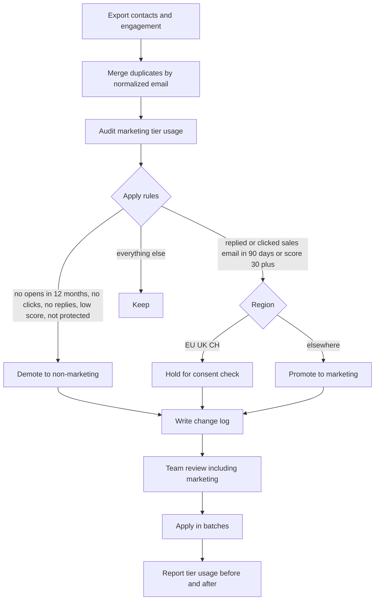

# Cleanup process

```mermaid
flowchart TD
    A[Export contacts and engagement] --> B[Merge duplicates by normalized email]
    B --> C[Audit marketing tier usage]
    C --> D{Apply rules}
    D -->|no opens in 12 months, no clicks, no replies, low score, not protected| E[Demote to non-marketing]
    D -->|replied or clicked sales email in 90 days or score 30 plus| F{Region}
    F -->|EU UK CH| G[Hold for consent check]
    F -->|elsewhere| H[Promote to marketing]
    D -->|everything else| I[Keep]
    E --> J[Write change log]
    G --> J
    H --> J
    J --> K[Team review including marketing]
    K --> L[Apply in batches]
    L --> M[Report tier usage before and after]
```
