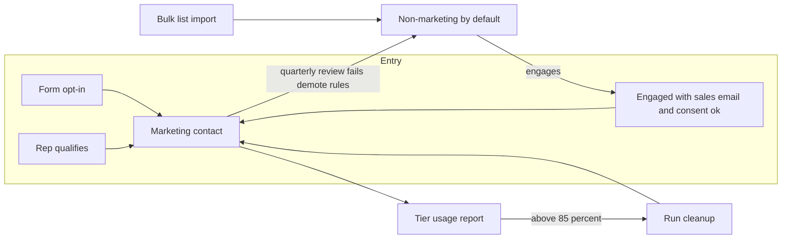

# Marketing-tier governance

```mermaid
flowchart LR
    subgraph Entry
      F[Form opt-in] --> M
      R[Rep qualifies] --> M
      P[Engaged with sales email and consent ok] --> M
    end
    I[Bulk list import] --> N[Non-marketing by default]
    N -->|engages| P
    M[Marketing contact] -->|quarterly review fails demote rules| N
    M --> T[Tier usage report]
    T -->|above 85 percent| Q[Run cleanup]
    Q --> M
```
