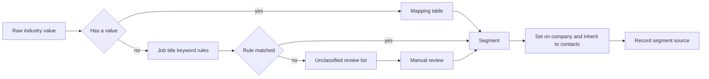

# Segmentation flow

```mermaid
flowchart LR
    A[Raw industry value] --> B{Has a value}
    B -->|yes| C[Mapping table]
    B -->|no| D[Job title keyword rules]
    C --> E[Segment]
    D --> F{Rule matched}
    F -->|yes| E
    F -->|no| G[Unclassified review list]
    E --> H[Set on company and inherit to contacts]
    H --> I[Record segment source]
    G --> J[Manual review]
    J --> E
```
