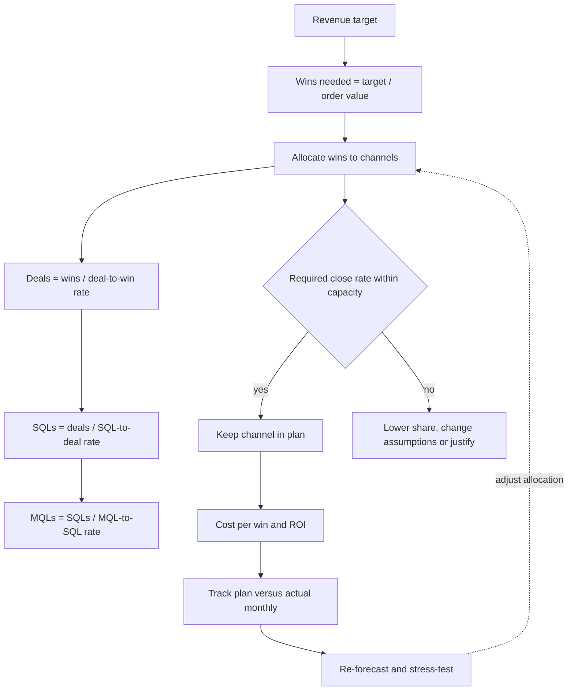

# Reverse funnel

```mermaid
flowchart TD
    T[Revenue target] --> W[Wins needed = target / order value]
    W --> A[Allocate wins to channels]
    A --> D[Deals = wins / deal-to-win rate]
    D --> S[SQLs = deals / SQL-to-deal rate]
    S --> M[MQLs = SQLs / MQL-to-SQL rate]
    A --> V{Required close rate within capacity}
    V -->|yes| OK[Keep channel in plan]
    V -->|no| R[Lower share, change assumptions or justify]
    OK --> C[Cost per win and ROI]
    C --> TR[Track plan versus actual monthly]
    TR --> F[Re-forecast and stress-test]
    F -.->|adjust allocation| A
```
