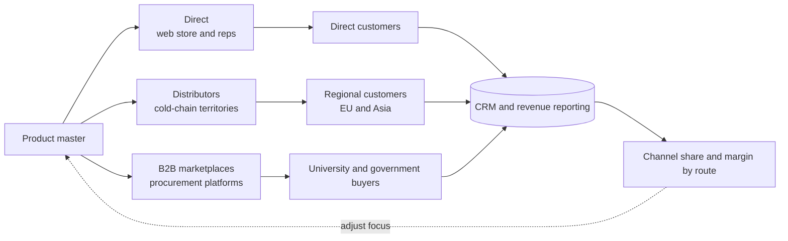
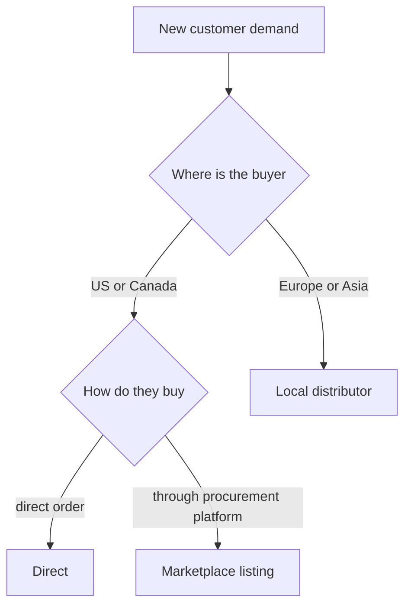

# Channel strategy

```mermaid
flowchart LR
    P[Product master] --> D[Direct<br/>web store and reps]
    P --> DI[Distributors<br/>cold-chain territories]
    P --> M[B2B marketplaces<br/>procurement platforms]
    D --> C1[Direct customers]
    DI --> C2[Regional customers<br/>EU and Asia]
    M --> C3[University and government buyers]
    C1 --> R[(CRM and revenue reporting)]
    C2 --> R
    C3 --> R
    R --> G[Channel share and margin by route]
    G -.->|adjust focus| P
```

## Who serves whom

```mermaid
flowchart TD
    A[New customer demand] --> B{Where is the buyer}
    B -->|US or Canada| C{How do they buy}
    B -->|Europe or Asia| DI[Local distributor]
    C -->|direct order| D[Direct]
    C -->|through procurement platform| M[Marketplace listing]
```
