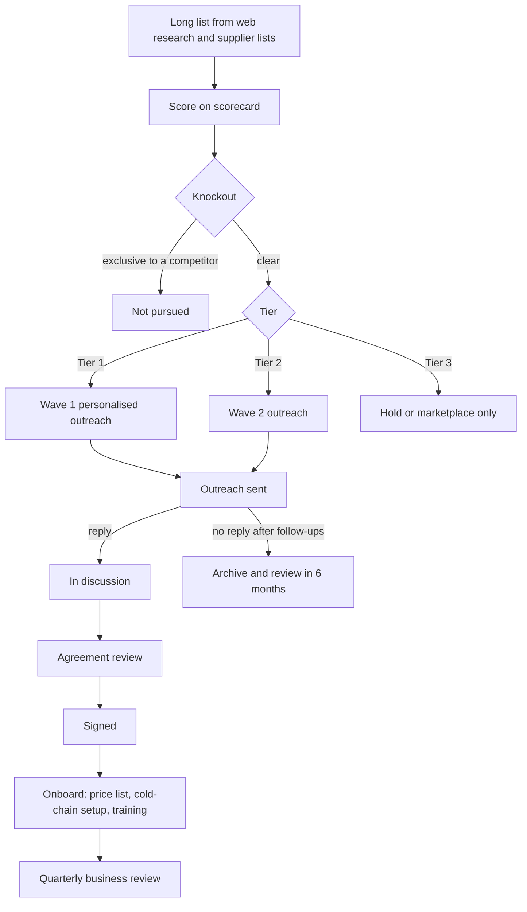

# Distributor pipeline

```mermaid
flowchart TD
    A[Long list from web research and supplier lists] --> B[Score on scorecard]
    B --> C{Knockout}
    C -->|exclusive to a competitor| X[Not pursued]
    C -->|clear| D{Tier}
    D -->|Tier 1| E[Wave 1 personalised outreach]
    D -->|Tier 2| F[Wave 2 outreach]
    D -->|Tier 3| G[Hold or marketplace only]
    E --> H[Outreach sent]
    F --> H
    H -->|reply| I[In discussion]
    H -->|no reply after follow-ups| J[Archive and review in 6 months]
    I --> K[Agreement review]
    K --> L[Signed]
    L --> M[Onboard: price list, cold-chain setup, training]
    M --> N[Quarterly business review]
```
