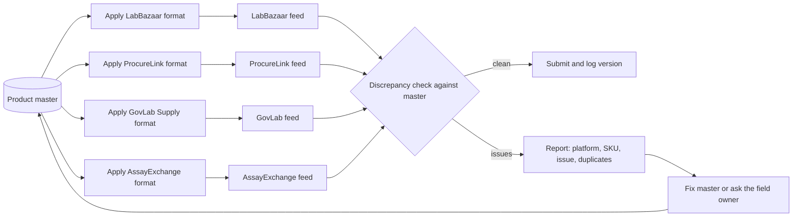

# Platform onboarding and data QA

```mermaid
flowchart LR
    M[(Product master)] --> T1[Apply LabBazaar format]
    M --> T2[Apply ProcureLink format]
    M --> T3[Apply GovLab Supply format]
    M --> T4[Apply AssayExchange format]
    T1 --> F1[LabBazaar feed]
    T2 --> F2[ProcureLink feed]
    T3 --> F3[GovLab feed]
    T4 --> F4[AssayExchange feed]
    F1 --> Q{Discrepancy check against master}
    F2 --> Q
    F3 --> Q
    F4 --> Q
    Q -->|clean| S[Submit and log version]
    Q -->|issues| R[Report: platform, SKU, issue, duplicates]
    R --> X[Fix master or ask the field owner]
    X --> M
```
