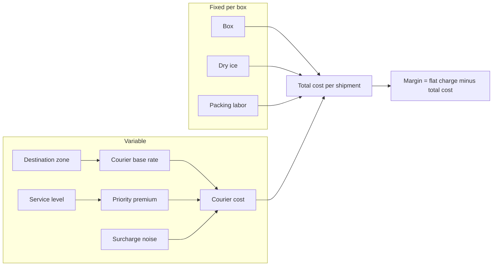

# Cost of one shipment

```mermaid
flowchart LR
    subgraph Fixed per box
      B[Box]
      D[Dry ice]
      L[Packing labor]
    end
    subgraph Variable
      Z[Destination zone] --> R[Courier base rate]
      S[Service level] --> P[Priority premium]
      R --> CC[Courier cost]
      P --> CC
      N[Surcharge noise] --> CC
    end
    B --> T[Total cost per shipment]
    D --> T
    L --> T
    CC --> T
    T --> M[Margin = flat charge minus total cost]
```
