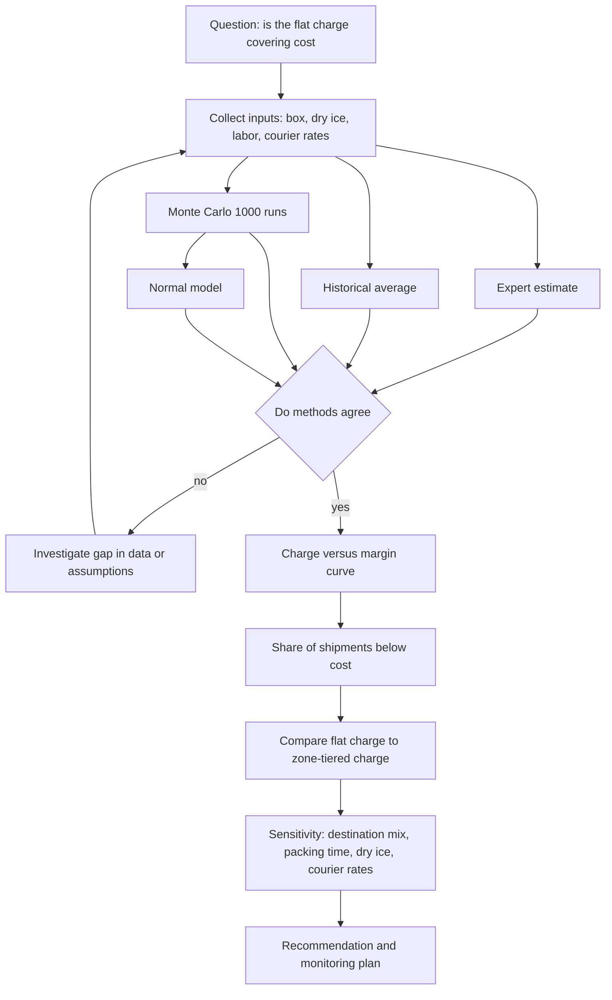

# From question to recommendation

```mermaid
flowchart TD
    Q[Question: is the flat charge covering cost] --> A[Collect inputs: box, dry ice, labor, courier rates]
    A --> M1[Expert estimate]
    A --> M2[Historical average]
    A --> M3[Monte Carlo 1000 runs]
    M3 --> M4[Normal model]
    M1 --> C{Do methods agree}
    M2 --> C
    M3 --> C
    M4 --> C
    C -->|no| I[Investigate gap in data or assumptions]
    I --> A
    C -->|yes| D[Charge versus margin curve]
    D --> E[Share of shipments below cost]
    E --> F[Compare flat charge to zone-tiered charge]
    F --> G[Sensitivity: destination mix, packing time, dry ice, courier rates]
    G --> R[Recommendation and monitoring plan]
```
