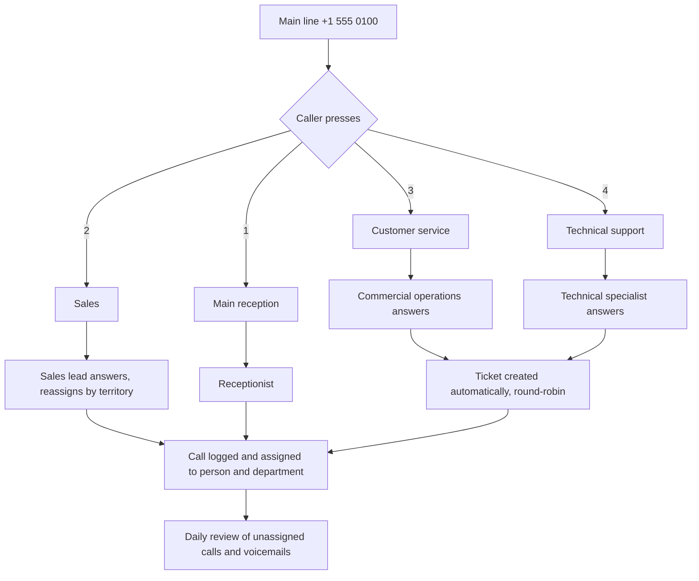

# Phone menu

```mermaid
flowchart TD
    M[Main line +1 555 0100] --> K{Caller presses}
    K -->|1| R[Main reception]
    K -->|2| S[Sales]
    K -->|3| C[Customer service]
    K -->|4| T[Technical support]
    R --> RA[Receptionist]
    S --> SA[Sales lead answers, reassigns by territory]
    C --> CA[Commercial operations answers]
    T --> TA[Technical specialist answers]
    CA --> TK[Ticket created automatically, round-robin]
    TA --> TK
    SA --> CL[Call logged and assigned to person and department]
    RA --> CL
    TK --> CL
    CL --> DR[Daily review of unassigned calls and voicemails]
```
