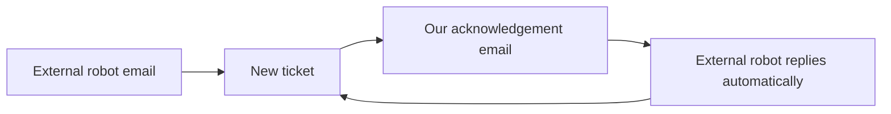
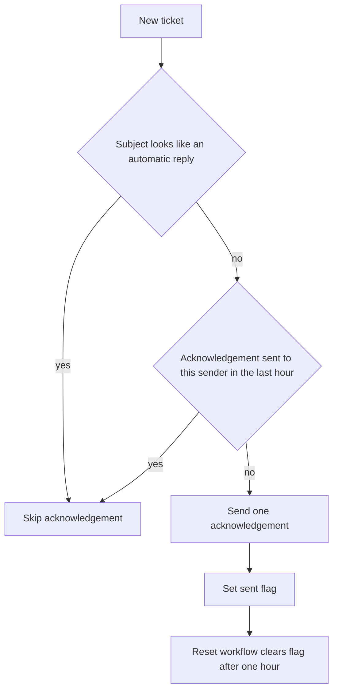

# Auto-reply loop and guardrails

## Without guardrails

```mermaid
flowchart LR
    A[External robot email] --> B[New ticket]
    B --> C[Our acknowledgement email]
    C --> D[External robot replies automatically]
    D --> B
```

## With guardrails

```mermaid
flowchart TD
    A[New ticket] --> B{Subject looks like an automatic reply}
    B -->|yes| X[Skip acknowledgement]
    B -->|no| C{Acknowledgement sent to this sender in the last hour}
    C -->|yes| X
    C -->|no| D[Send one acknowledgement]
    D --> E[Set sent flag]
    E --> F[Reset workflow clears flag after one hour]
```
