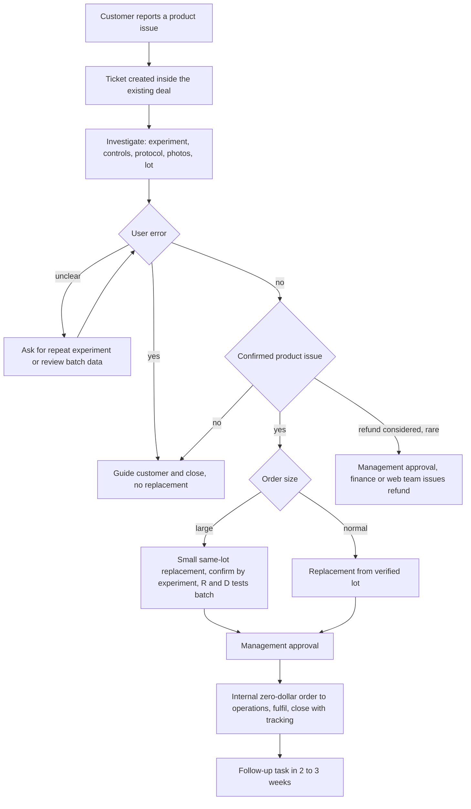

# Refund and replacement flow

```mermaid
flowchart TD
    A[Customer reports a product issue] --> B[Ticket created inside the existing deal]
    B --> C[Investigate: experiment, controls, protocol, photos, lot]
    C --> D{User error}
    D -->|yes| E[Guide customer and close, no replacement]
    D -->|unclear| F[Ask for repeat experiment or review batch data]
    F --> D
    D -->|no| G{Confirmed product issue}
    G -->|no| E
    G -->|yes| H{Order size}
    H -->|large| I[Small same-lot replacement, confirm by experiment, R and D tests batch]
    H -->|normal| J[Replacement from verified lot]
    I --> K[Management approval]
    J --> K
    K --> L[Internal zero-dollar order to operations, fulfil, close with tracking]
    L --> M[Follow-up task in 2 to 3 weeks]
    G -->|refund considered, rare| N[Management approval, finance or web team issues refund]
```
