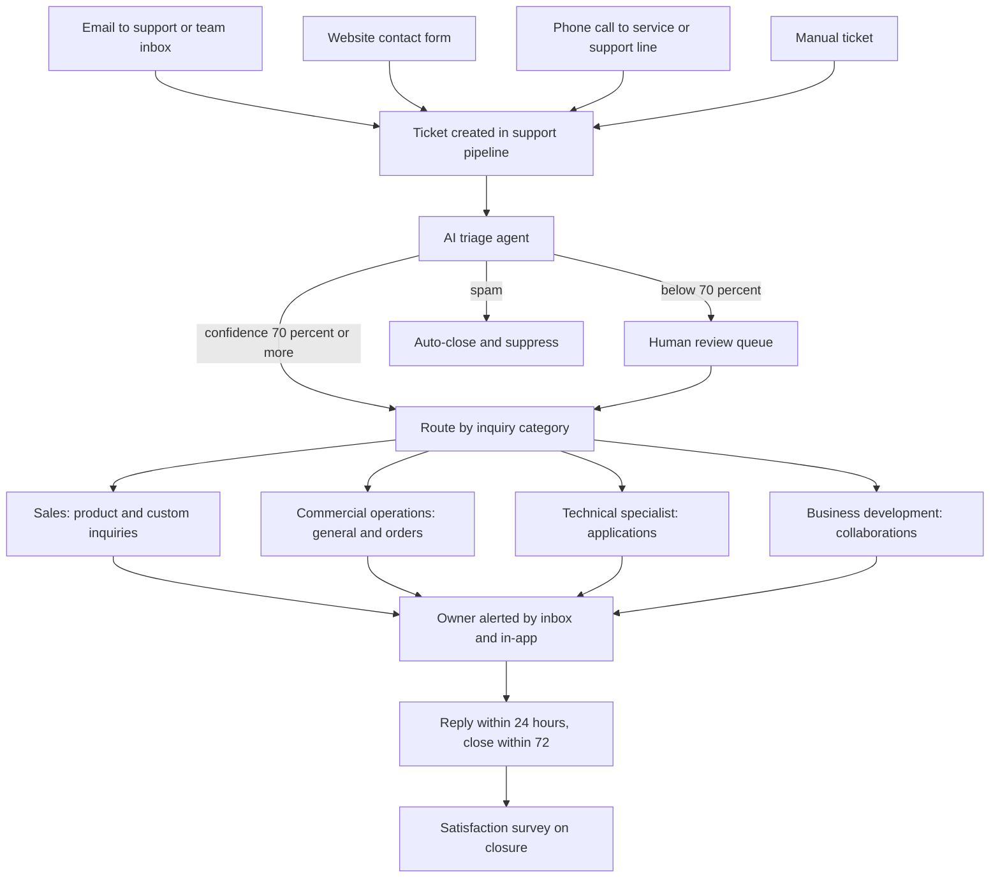

# Ticket intake and routing

```mermaid
flowchart TD
    E[Email to support or team inbox] --> T[Ticket created in support pipeline]
    F[Website contact form] --> T
    P[Phone call to service or support line] --> T
    M[Manual ticket] --> T
    T --> AG[AI triage agent]
    AG -->|confidence 70 percent or more| R[Route by inquiry category]
    AG -->|below 70 percent| Q[Human review queue]
    Q --> R
    AG -->|spam| SP[Auto-close and suppress]
    R --> O1[Sales: product and custom inquiries]
    R --> O2[Commercial operations: general and orders]
    R --> O3[Technical specialist: applications]
    R --> O4[Business development: collaborations]
    O1 --> W[Owner alerted by inbox and in-app]
    O2 --> W
    O3 --> W
    O4 --> W
    W --> S[Reply within 24 hours, close within 72]
    S --> CES[Satisfaction survey on closure]
```
