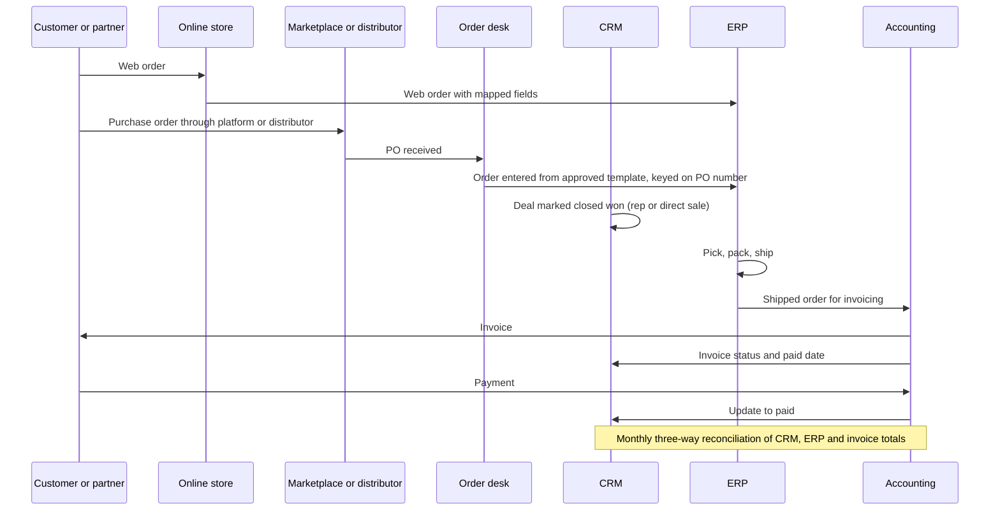

# Order flow, every channel

```mermaid
sequenceDiagram
    participant C as Customer or partner
    participant S as Online store
    participant M as Marketplace or distributor
    participant D as Order desk
    participant R as CRM
    participant E as ERP
    participant A as Accounting
    C->>S: Web order
    S->>E: Web order with mapped fields
    C->>M: Purchase order through platform or distributor
    M->>D: PO received
    D->>E: Order entered from approved template, keyed on PO number
    R->>R: Deal marked closed won (rep or direct sale)
    E->>E: Pick, pack, ship
    E->>A: Shipped order for invoicing
    A->>C: Invoice
    A->>R: Invoice status and paid date
    C->>A: Payment
    A->>R: Update to paid
    Note over R,A: Monthly three-way reconciliation of CRM, ERP and invoice totals
```

All channels create the same ERP order record and the same invoice path.
