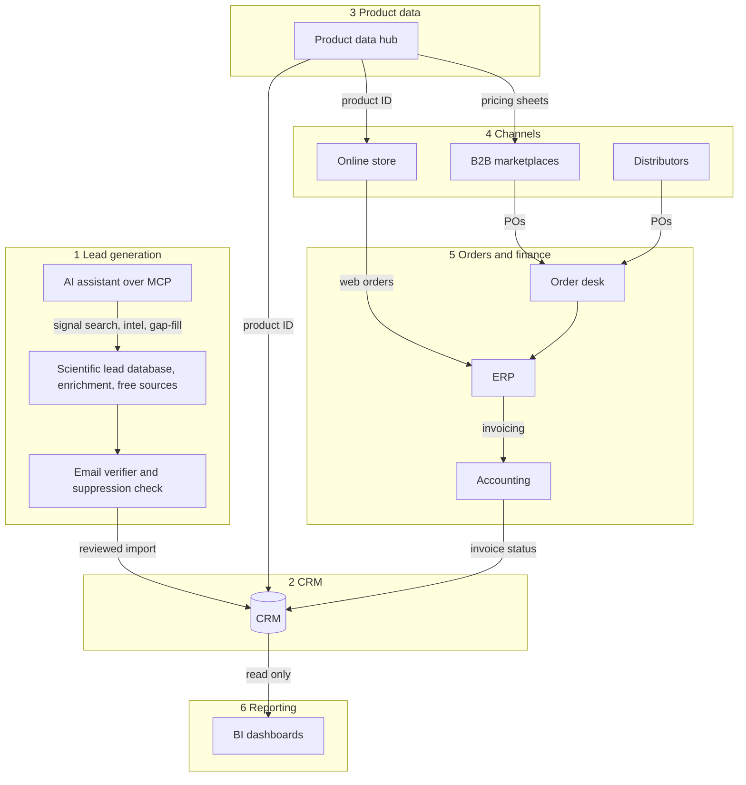
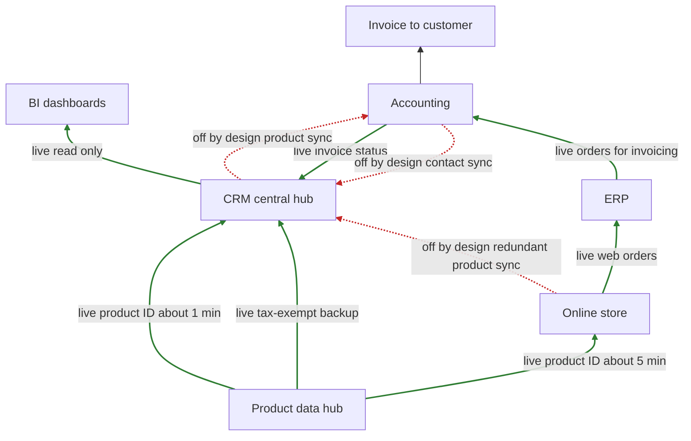

# System map

## At a glance: six layers

```mermaid
flowchart TB
    subgraph L1[1 Lead generation]
      AI[AI assistant over MCP] -->|signal search, intel, gap-fill| LS
      LS[Scientific lead database, enrichment, free sources] --> VF[Email verifier and suppression check]
    end
    subgraph L2[2 CRM]
      CRM[(CRM)]
    end
    subgraph L3[3 Product data]
      PH[Product data hub]
    end
    subgraph L4[4 Channels]
      ST[Online store]
      MP[B2B marketplaces]
      DI[Distributors]
    end
    subgraph L5[5 Orders and finance]
      OD[Order desk]
      ERP[ERP]
      AC[Accounting]
    end
    subgraph L6[6 Reporting]
      BI[BI dashboards]
    end
    VF -->|reviewed import| CRM
    PH -->|product ID| CRM
    PH -->|product ID| ST
    PH -->|pricing sheets| MP
    ST -->|web orders| ERP
    MP -->|POs| OD
    DI -->|POs| OD
    OD --> ERP
    ERP -->|invoicing| AC
    AC -->|invoice status| CRM
    CRM -->|read only| BI
```

## Connection detail (colour shows status)

```mermaid
flowchart BT
    BI[BI dashboards]
    CRM[CRM central hub]
    AC[Accounting]
    PH[Product data hub]
    ST[Online store]
    ERP[ERP]
    CU[Invoice to customer]
    CRM -->|live read only| BI
    PH -->|live product ID about 1 min| CRM
    PH -->|live tax-exempt backup| CRM
    AC -->|live invoice status| CRM
    CRM -.->|off by design product sync| AC
    AC -.->|off by design contact sync| CRM
    ST -.->|off by design redundant product sync| CRM
    PH -->|live product ID about 5 min| ST
    ST -->|live web orders| ERP
    ERP -->|live orders for invoicing| AC
    AC --> CU
    linkStyle 0,1,2,3 stroke:#2e7d32,stroke-width:2px
    linkStyle 4,5,6 stroke:#c62828,stroke-width:2px
    linkStyle 7,8,9 stroke:#2e7d32,stroke-width:2px
```

Solid green lines are live; dotted red lines are connections switched off on purpose.
