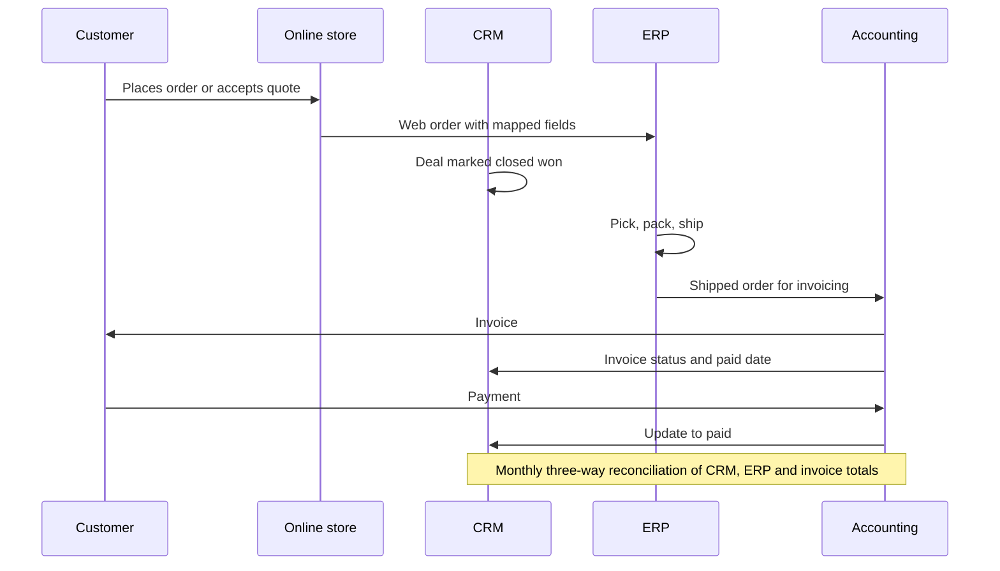

# Order flow

```mermaid
sequenceDiagram
    participant C as Customer
    participant S as Online store
    participant R as CRM
    participant E as ERP
    participant A as Accounting
    C->>S: Places order or accepts quote
    S->>E: Web order with mapped fields
    R->>R: Deal marked closed won
    E->>E: Pick, pack, ship
    E->>A: Shipped order for invoicing
    A->>C: Invoice
    A->>R: Invoice status and paid date
    C->>A: Payment
    A->>R: Update to paid
    Note over R,A: Monthly three-way reconciliation of CRM, ERP and invoice totals
```
