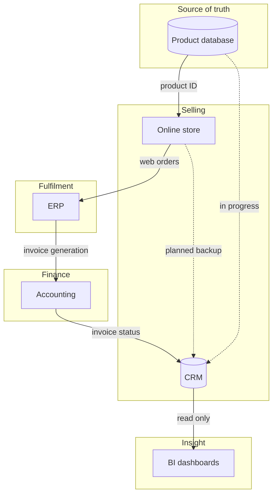

# System map

```mermaid
flowchart TB
    subgraph Source of truth
      PDB[(Product database)]
    end
    subgraph Selling
      STORE[Online store]
      CRM[(CRM)]
    end
    subgraph Fulfilment
      ERP[ERP]
    end
    subgraph Finance
      ACC[Accounting]
    end
    subgraph Insight
      BI[BI dashboards]
    end
    PDB -->|product ID| STORE
    PDB -.->|in progress| CRM
    STORE -->|web orders| ERP
    ERP -->|invoice generation| ACC
    ACC -->|invoice status| CRM
    CRM -->|read only| BI
    STORE -.->|planned backup| CRM
```

Solid lines are live, dotted lines are in progress or planned. Syncs between the CRM and accounting for products and contacts are off by design.
