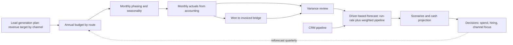

# Planning cycle

```mermaid
flowchart LR
    A[Lead generation plan: revenue target by channel] --> B[Annual budget by route]
    B --> C[Monthly phasing and seasonality]
    C --> D[Monthly actuals from accounting]
    D --> E[Variance review]
    E --> F[Driver-based forecast: run-rate plus weighted pipeline]
    F --> G[Scenarios and cash projection]
    G --> H[Decisions: spend, hiring, channel focus]
    H -.->|reforecast quarterly| B
    P[CRM pipeline] --> F
    D --> R[Won to invoiced bridge]
    R --> E
```
