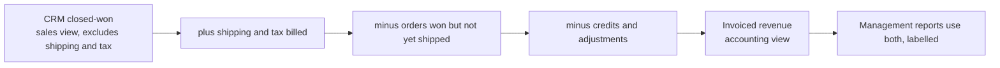

# CRM won to invoiced revenue

```mermaid
flowchart LR
    A[CRM closed-won<br/>sales view, excludes shipping and tax] --> B[plus shipping and tax billed]
    B --> C[minus orders won but not yet shipped]
    C --> D[minus credits and adjustments]
    D --> E[Invoiced revenue<br/>accounting view]
    E --> F[Management reports use both, labelled]
```
