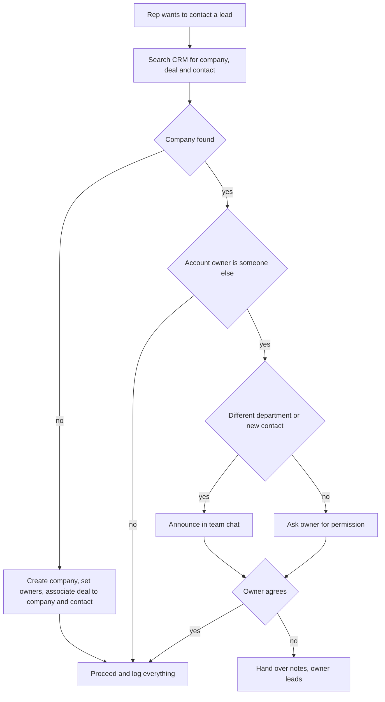

# "Research first" check

```mermaid
flowchart TD
    A[Rep wants to contact a lead] --> B[Search CRM for company, deal and contact]
    B --> C{Company found}
    C -->|no| D[Create company, set owners, associate deal to company and contact]
    C -->|yes| E{Account owner is someone else}
    E -->|no| F[Proceed and log everything]
    E -->|yes| G{Different department or new contact}
    G -->|yes| H[Announce in team chat]
    G -->|no| I[Ask owner for permission]
    H --> J{Owner agrees}
    I --> J
    J -->|yes| F
    J -->|no| K[Hand over notes, owner leads]
    D --> F
```
