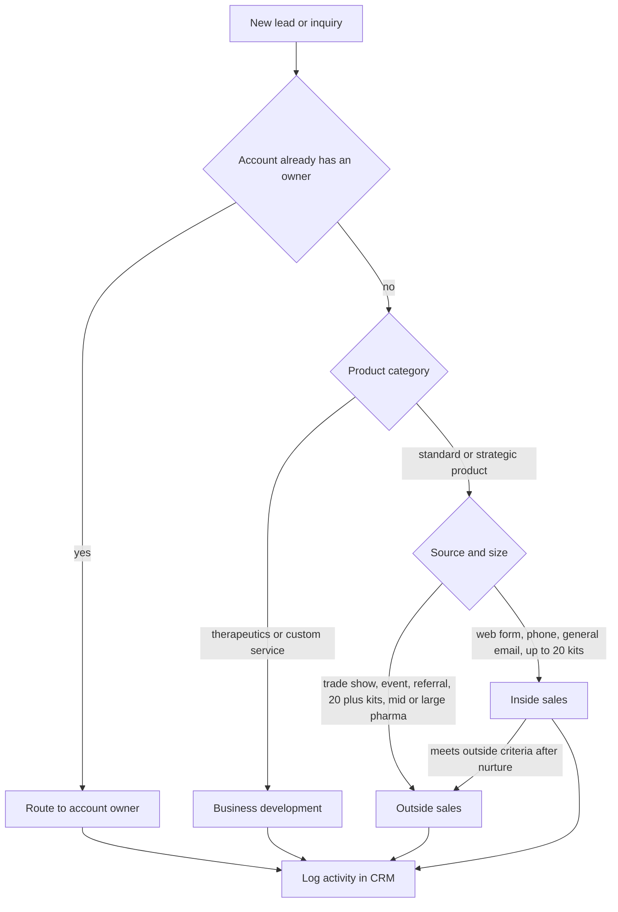

# Lead routing

```mermaid
flowchart TD
    A[New lead or inquiry] --> B{Account already has an owner}
    B -->|yes| C[Route to account owner]
    B -->|no| D{Product category}
    D -->|therapeutics or custom service| BD[Business development]
    D -->|standard or strategic product| E{Source and size}
    E -->|trade show, event, referral, 20 plus kits, mid or large pharma| OS[Outside sales]
    E -->|web form, phone, general email, up to 20 kits| IS[Inside sales]
    C --> F[Log activity in CRM]
    BD --> F
    OS --> F
    IS --> F
    IS -->|meets outside criteria after nurture| OS
```
