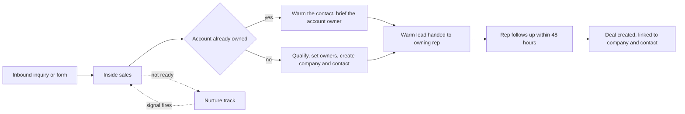

# Warm-lead model (current)

```mermaid
flowchart LR
    A[Inbound inquiry or form] --> B[Inside sales]
    B --> C{Account already owned}
    C -->|yes| D[Warm the contact, brief the account owner]
    C -->|no| E[Qualify, set owners, create company and contact]
    D --> F[Warm lead handed to owning rep]
    E --> F
    F --> G[Rep follows up within 48 hours]
    G --> H[Deal created, linked to company and contact]
    B -.->|not ready| N[Nurture track]
    N -.->|signal fires| B
```

Inside sales is the warm-up layer: it turns inbound interest into conversations, then hands over with notes so reps start from context rather than a cold email.
