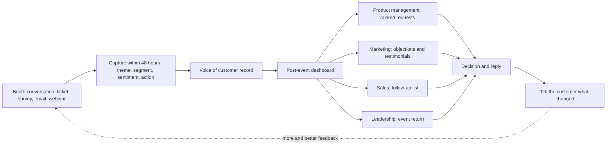

# VOC loop

```mermaid
flowchart LR
    A[Booth conversation, ticket, survey, email, webinar] --> B[Capture within 48 hours: theme, segment, sentiment, action]
    B --> C[Voice of customer record]
    C --> D[Post-event dashboard]
    D --> E1[Product management: ranked requests]
    D --> E2[Marketing: objections and testimonials]
    D --> E3[Sales: follow-up list]
    D --> E4[Leadership: event return]
    E1 --> F[Decision and reply]
    E2 --> F
    E3 --> F
    E4 --> F
    F --> G[Tell the customer what changed]
    G -.->|more and better feedback| A
```
