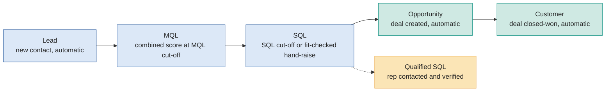
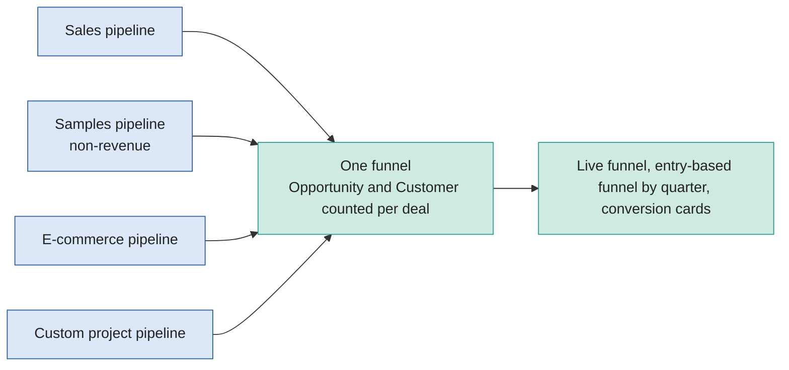

# Lifecycle and pipelines

## Lifecycle stages

```mermaid
flowchart LR
    A["Lead<br>new contact, automatic"] --> B["MQL<br>combined score at MQL cut-off"]
    B --> C["SQL<br>SQL cut-off or fit-checked hand-raise"]
    C --> D["Opportunity<br>deal created, automatic"]
    D --> E["Customer<br>deal closed-won, automatic"]
    C -.-> Q["Qualified SQL<br>rep contacted and verified"]
    classDef a fill:#DCE8F7,stroke:#2B5C9E,color:#222
    classDef g fill:#CFE9E3,stroke:#2A9D8F,color:#222
    classDef y fill:#FBE5B6,stroke:#E9A23B,color:#222
    class A,B,C a
    class D,E g
    class Q y
```

## Four pipelines, one funnel

```mermaid
flowchart LR
    P1["Sales pipeline"] --> F["One funnel<br>Opportunity and Customer counted per deal"]
    P2["Samples pipeline<br>non-revenue"] --> F
    P3["E-commerce pipeline"] --> F
    P4["Custom project pipeline"] --> F
    F --> R["Live funnel, entry-based funnel by quarter, conversion cards"]
    classDef a fill:#DCE8F7,stroke:#2B5C9E,color:#222
    classDef g fill:#CFE9E3,stroke:#2A9D8F,color:#222
    class P1,P2,P3,P4 a
    class F,R g
```
