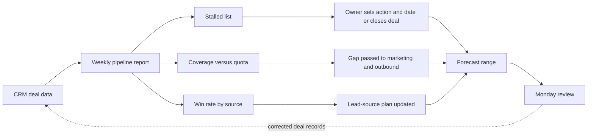

# Pipeline review flow

```mermaid
flowchart LR
    A[CRM deal data] --> B[Weekly pipeline report]
    B --> C1[Stalled list]
    B --> C2[Coverage versus quota]
    B --> C3[Win rate by source]
    C1 --> D1[Owner sets action and date or closes deal]
    C2 --> D2[Gap passed to marketing and outbound]
    C3 --> D3[Lead-source plan updated]
    D1 --> E[Forecast range]
    D2 --> E
    D3 --> E
    E --> F[Monday review]
    F -.->|corrected deal records| A
```
