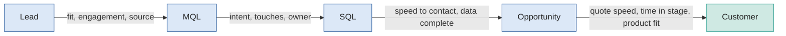
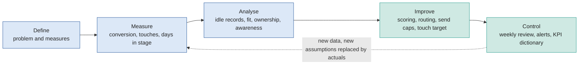

# The sales funnel and what drives each step

```mermaid
flowchart LR
    A["Lead"] -->|"fit, engagement, source"| B["MQL"]
    B -->|"intent, touches, owner"| C["SQL"]
    C -->|"speed to contact, data complete"| D["Opportunity"]
    D -->|"quote speed, time in stage, product fit"| E["Customer"]
    classDef a fill:#DCE8F7,stroke:#2B5C9E,color:#222
    classDef g fill:#CFE9E3,stroke:#2A9D8F,color:#222
    class A,B,C,D a
    class E g
```

# Six Sigma DMAIC applied to the funnel

```mermaid
flowchart LR
    D["Define<br>problem and measures"] --> M["Measure<br>conversion, touches, days in stage"] --> A["Analyse<br>idle records, fit, ownership, awareness"] --> I["Improve<br>scoring, routing, send caps, touch target"] --> C["Control<br>weekly review, alerts, KPI dictionary"]
    C -.->|"new data, new assumptions replaced by actuals"| M
    classDef a fill:#DCE8F7,stroke:#2B5C9E,color:#222
    classDef g fill:#CFE9E3,stroke:#2A9D8F,color:#222
    class D,M,A a
    class I,C g
```
