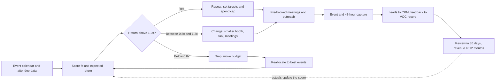

# Event decision flow

```mermaid
flowchart LR
    A[Event calendar and attendee data] --> B[Score fit and expected return]
    B --> C{Return above 1.2x?}
    C -->|Yes| D[Repeat: set targets and spend cap]
    C -->|Between 0.8x and 1.2x| E[Change: smaller booth, talk, meetings]
    C -->|Below 0.8x| F[Drop: move budget]
    D --> G[Pre-booked meetings and outreach]
    E --> G
    G --> H[Event and 48-hour capture]
    H --> I[Leads to CRM, feedback to VOC record]
    I --> J[Review in 30 days, revenue at 12 months]
    J -.->|actuals update the score| B
    F --> K[Reallocate to best events]
    K --> B
```
