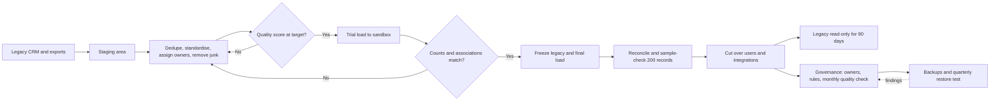

# Migration flow

```mermaid
flowchart LR
    A[Legacy CRM and exports] --> B[Staging area]
    B --> C[Dedupe, standardise, assign owners, remove junk]
    C --> D{Quality score at target?}
    D -->|No| C
    D -->|Yes| E[Trial load to sandbox]
    E --> F{Counts and associations match?}
    F -->|No| C
    F -->|Yes| G[Freeze legacy and final load]
    G --> H[Reconcile and sample-check 200 records]
    H --> I[Cut over users and integrations]
    I --> J[Legacy read-only for 90 days]
    I --> K[Governance: owners, rules, monthly quality check]
    K --> L[Backups and quarterly restore test]
    L -.->|findings| K
```
