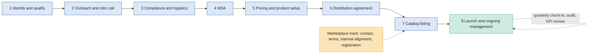

# Onboarding flow: eight stages

```mermaid
flowchart LR
    A["1 Identify and qualify"] --> B["2 Outreach and intro call"] --> C["3 Compliance and logistics"] --> D["4 NDA"]
    D --> E["5 Pricing and product setup"] --> F["6 Distribution agreement"] --> G["7 Catalog listing"] --> H["8 Launch and ongoing management"]
    H -.->|"quarterly check-in, audit, KPI review"| H
    M["Marketplace track: contact, terms, internal alignment, registration"] -.-> G
    classDef a fill:#DCE8F7,stroke:#2B5C9E,color:#222
    classDef g fill:#CFE9E3,stroke:#2A9D8F,color:#222
    classDef y fill:#FBE5B6,stroke:#E9A23B,color:#222
    class A,B,C,D a
    class E,F,G a
    class H g
    class M y
```

Owners and target times for each stage are in [../docs/distributor_onboarding_journey.md](../docs/distributor_onboarding_journey.md).
