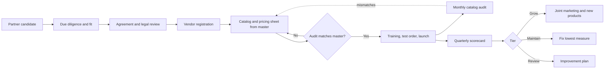

# Onboarding and audit flow

```mermaid
flowchart LR
    A[Partner candidate] --> B[Due diligence and fit]
    B --> C[Agreement and legal review]
    C --> D[Vendor registration]
    D --> E[Catalog and pricing sheet from master]
    E --> F{Audit matches master?}
    F -->|No| E
    F -->|Yes| G[Training, test order, launch]
    G --> H[Monthly catalog audit]
    G --> I[Quarterly scorecard]
    H -.->|mismatches| E
    I --> J{Tier}
    J -->|Grow| K[Joint marketing and new products]
    J -->|Maintain| L[Fix lowest measure]
    J -->|Review| M[Improvement plan]
```
