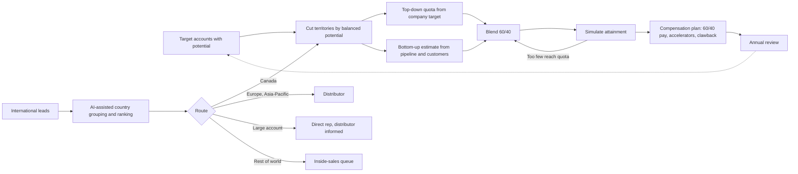

# Territory, quota and pay flow

```mermaid
flowchart LR
    A[Target accounts with potential] --> B[Cut territories by balanced potential]
    L[International leads] --> M[AI-assisted country grouping and ranking]
    M --> N{Route}
    N -->|Canada| B
    N -->|Europe, Asia-Pacific| P[Distributor]
    N -->|Large account| Q[Direct rep, distributor informed]
    N -->|Rest of world| R[Inside-sales queue]
    B --> C[Top-down quota from company target]
    B --> D[Bottom-up estimate from pipeline and customers]
    C --> E[Blend 60/40]
    D --> E
    E --> F[Simulate attainment]
    F -->|Too few reach quota| E
    F --> G[Compensation plan: 60/40 pay, accelerators, clawback]
    G --> H[Annual review]
    H -.-> A
```
