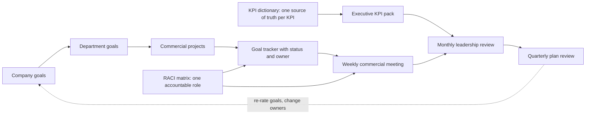

# Operating rhythm

```mermaid
flowchart LR
    A[Company goals] --> B[Department goals]
    B --> C[Commercial projects]
    C --> D[Goal tracker with status and owner]
    E[KPI dictionary: one source of truth per KPI] --> F[Executive KPI pack]
    D --> G[Weekly commercial meeting]
    F --> H[Monthly leadership review]
    G --> H
    H --> I[Quarterly plan review]
    I -.->|re-rate goals, change owners| A
    R[RACI matrix: one accountable role] --> D
    R --> G
```
