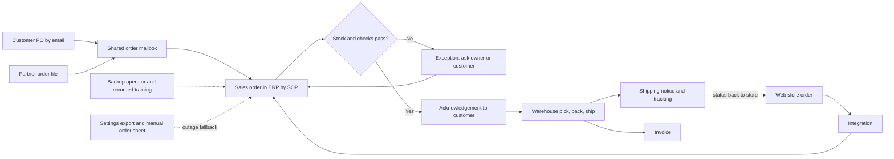

# Order workflow

```mermaid
flowchart LR
    A[Customer PO by email] --> M[Shared order mailbox]
    W[Web store order] --> I[Integration]
    P[Partner order file] --> M
    M --> S[Sales order in ERP by SOP]
    I --> S
    S --> C{Stock and checks pass?}
    C -->|No| X[Exception: ask owner or customer]
    X --> S
    C -->|Yes| K[Acknowledgement to customer]
    K --> R[Warehouse pick, pack, ship]
    R --> N[Shipping notice and tracking]
    R --> V[Invoice]
    N -.->|status back to store| W
    B[Backup operator and recorded training] -.-> S
    O[Settings export and manual order sheet] -.->|outage fallback| S
```
